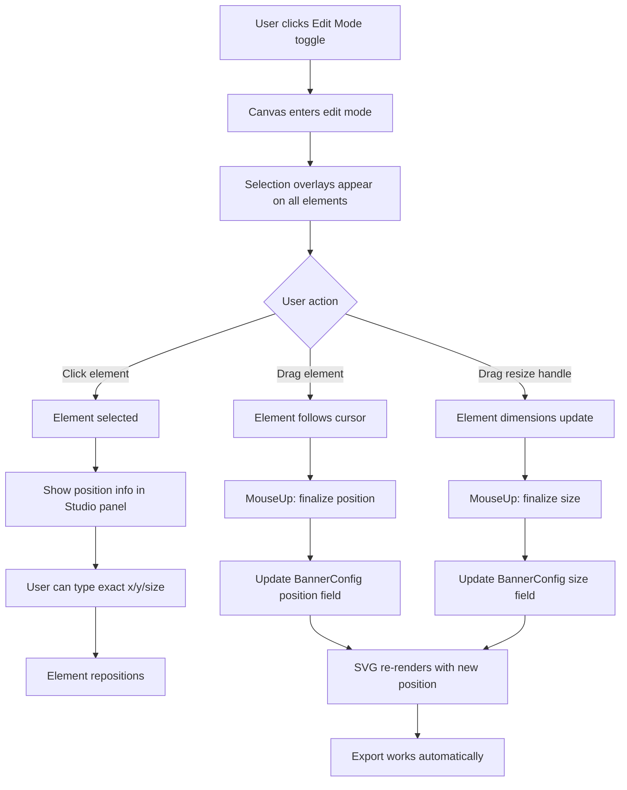
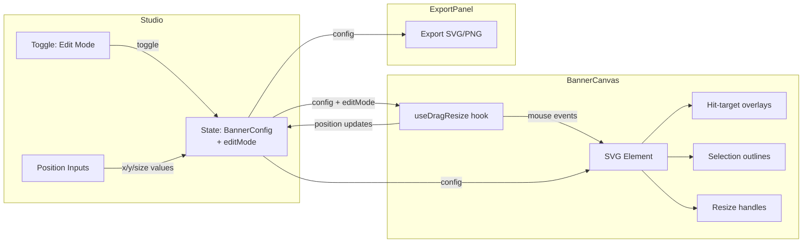

# Drag-and-Drop & Resize for Banner Canvas Elements

## Overview

Currently, all canvas elements (text blocks, logos, skills row, git badge) have **hardcoded computed positions** derived from format dimensions and scale factors. The user wants to freely **drag** elements anywhere on the canvas and **resize** them interactively.

This plan adds a lightweight drag-and-drop + resize interaction layer directly on the SVG, without external libraries.

---

## Architecture

### 1. Data Model Changes (`src/components/types.ts`)

Add position/size overrides to [`BannerConfig`](src/components/types.ts:13). Each movable element gets optional `x`, `y`, and `size` fields. When set, these override the computed default position.

```typescript
export type ElementPosition = {
  x: number   // SVG viewBox x-coordinate
  y: number   // SVG viewBox y-coordinate
}

export type ElementSize = {
  width?: number   // override width in viewBox units
  height?: number  // override height in viewBox units
}

export type BannerConfig = {
  // ... existing fields ...

  // ─── Drag-and-drop position overrides ───
  // When null/undefined, the element uses its computed default position.
  // When set, these override the x/y/size in the SVG viewBox.

  // Text positions (x = leftPad override, y = vertical position override)
  namePos?:    ElementPosition
  rolePos?:    ElementPosition
  teamPos?:    ElementPosition
  taglinePos?: ElementPosition

  // Skills row position
  skillsPos?:  ElementPosition

  // Logo positions
  currentLogoPos?: ElementPosition & { size?: number }  // size overrides logoSize
  pastLogosPos?:   ElementPosition & { size?: number }

  // Git badge position
  gitBadgePos?: ElementPosition
}
```

**Key design decision:** Individual explicit fields (not a unified array) — keeps type safety, aligns with existing pattern, and avoids breaking the export/summary logic.

### 2. Interaction Layer (`src/components/BannerCanvas.tsx`)

A new `useDragResize` hook manages all mouse/touch interaction state.

#### State managed by the hook:

```typescript
type DragState = {
  active: boolean
  elementType: string       // 'name' | 'role' | 'team' | 'tagline' | 'skills' | 'currentLogo' | 'pastLogos' | 'gitBadge'
  mode: 'move' | 'resize'  // whether we're dragging or resizing
  startMouseX: number       // SVG viewBox X at mousedown
  startMouseY: number       // SVG viewBox Y at mousedown
  startElX: number          // element's x at mousedown
  startElY: number          // element's y at mousedown
  startElSize?: number      // element's size at mousedown (for resize)
  handle?: string           // which resize handle: 'se' | 'sw' | 'ne' | 'nw'
}
```

#### Event flow:

1. **`onMouseDown` on SVG** — Convert mouse coords to viewBox coords using `svg.createSVGPoint()`. Hit-test against element bounding boxes. If hit, set drag state.
2. **`onMouseMove` on SVG** — If dragging, compute delta from start position, update element position/size in real-time via `setCfg` callback.
3. **`onMouseUp` on SVG** — Finalize position, clear drag state.

#### Hit-testing:

Each element group gets an invisible `<rect>` overlay (transparent fill, no stroke) that covers its bounding box. On mousedown, iterate these overlays to find which element was clicked.

```typescript
// Each draggable element renders an invisible hit-target rect:
<rect
  x={elX} y={elY}
  width={elWidth} height={elHeight}
  fill="transparent"
  style={{ cursor: 'move' }}
  data-element="name"
/>
```

#### Resize handles:

When an element is **selected** (clicked), render 4 corner handles as small `<rect>` or `<circle>` elements at its corners. Dragging a handle triggers resize mode.

```
┌───┬──────────┬───┐
│   │          │   │  ← corner handles (8×8 px circles)
├───┤          ├───┤
│   │  ELEMENT │   │
├───┤          ├───┤
│   │          │   │
└───┴──────────┴───┘
```

#### Visual feedback:

- **Selected element:** Thin dashed border (`stroke-dasharray="4 3"`) in accent color around the element's bounding box.
- **Dragging:** Element follows cursor in real-time. Slight opacity reduction (0.85) during drag.
- **Resizing:** Element dimensions update in real-time. Corner handle highlights on hover.

### 3. Coordinate Conversion

SVG viewBox coordinates differ from screen pixel coordinates. Use the standard SVG API:

```typescript
function svgPoint(svg: SVGSVGElement, clientX: number, clientY: number): DOMPoint {
  const pt = svg.createSVGPoint()
  pt.x = clientX
  pt.y = clientY
  return pt.matrixTransform(svg.getScreenCTM()!.inverse())
}
```

### 4. UI Controls (`src/components/Studio.tsx`)

Add a toggle to enter/exit **"Edit Mode"** (drag-and-drop mode):

- **Edit Mode OFF** (default): Canvas renders as today — no selection outlines, no drag behavior.
- **Edit Mode ON**: Selection outlines appear on hover. Click to select. Drag to move. Drag corner handles to resize.

Add a small floating toolbar or info bar when an element is selected:

```
[Selected: Name]  X: 120  Y: 45  Size: 44px  [Reset Position]
```

This toolbar appears in the Studio panel below the canvas preview, not on the canvas itself.

### 5. Reset Behavior

Each element gets a "Reset Position" button in the Studio panel (visible only in Edit Mode) that clears its position override, snapping it back to the computed default.

### 6. Export Compatibility

The drag-and-drop interaction layer uses **React state** (`BannerConfig` position fields), not DOM mutations. The export pipeline (`ExportPanel.tsx`) reads the SVG ref and serializes it — since position overrides are applied as SVG attributes during render, the exported SVG/PNG will include the user's custom positions automatically. **No changes needed to ExportPanel.**

---

## Implementation Steps

### Step 1: Update Types (`src/components/types.ts`)

- Add `ElementPosition` type
- Add `ElementSize` type  
- Add optional position/size fields to `BannerConfig`

### Step 2: Create `useDragResize` Hook (`src/components/useDragResize.ts`)

New file containing:

- `DragState` type
- `useDragResize(config, setCfg, svgRef)` hook
- Returns: `{ selectedElement, dragState, handlers: { onMouseDown, onMouseMove, onMouseUp }, selectElement, resetPosition }`
- Handles coordinate conversion, hit-testing, drag delta computation, resize delta computation

### Step 3: Update `BannerCanvas.tsx`

- Import and use `useDragResize` hook
- Add `editMode` prop (boolean)
- When `editMode` is true:
  - Render invisible hit-target rects over each draggable element
  - Render selection outline (dashed border) on selected element
  - Render resize handles on selected element's corners
  - Apply position overrides from config (if set) instead of computed defaults
  - Attach mouse event handlers to SVG
- When `editMode` is false:
  - Render as today (no interaction overlays)

### Step 4: Update `Studio.tsx`

- Add `editMode` state (boolean, default false)
- Add "Edit Mode" toggle button near the canvas preview
- Pass `editMode` and `onConfigChange` to `BannerCanvas`
- When `editMode` is true and an element is selected, show position/size inputs and "Reset Position" button
- Update the DEFAULT config to include null position fields

### Step 5: Update `ExportPanel.tsx`

- No changes needed — positions are part of the rendered SVG

---

## Files Modified

| File | Change |
|------|--------|
| [`src/components/types.ts`](src/components/types.ts) | Add `ElementPosition`, `ElementSize`, position fields to `BannerConfig` |
| `src/components/useDragResize.ts` | **New file** — drag/resize hook |
| [`src/components/BannerCanvas.tsx`](src/components/BannerCanvas.tsx) | Integrate hook, render hit-targets, selection outlines, resize handles |
| [`src/components/Studio.tsx`](src/components/Studio.tsx) | Add Edit Mode toggle, position controls, reset buttons |

---

## Mermaid Diagram: Interaction Flow



---

## Mermaid Diagram: Component Data Flow



---

## Edge Cases & Considerations

1. **LinkedIn format (profile photo zone):** The `leftPad` is 38% for LinkedIn. Position overrides should still work — if user drags an element into the 0-30% zone, it will overlap the profile photo area. This is intentional (user's choice).

2. **Responsive scaling:** Positions are stored in viewBox coordinates, so they scale correctly across different display sizes. The `scaleH`/`scaleW` factors are only used for computed defaults — overridden positions use raw viewBox coordinates.

3. **Touch support:** The hook should handle `onTouchStart`/`onTouchMove`/`onTouchEnd` in addition to mouse events, using `e.touches[0].clientX/clientY`.

4. **Minimum size:** Resize should enforce a minimum size (e.g., 20px width/height for logos, 8px for text) to prevent elements from becoming invisible.

5. **Canvas boundaries:** Elements should not be draggable outside the canvas bounds (x < 0, y < 0, x + width > canvas width, y + height > canvas height).

6. **Multiple elements overlap:** The hit-testing order should match SVG z-order (last rendered = topmost). The most recently clicked element becomes selected.

7. **Performance:** Use `useCallback` for event handlers and `useMemo` for computed values to prevent unnecessary re-renders during drag.
